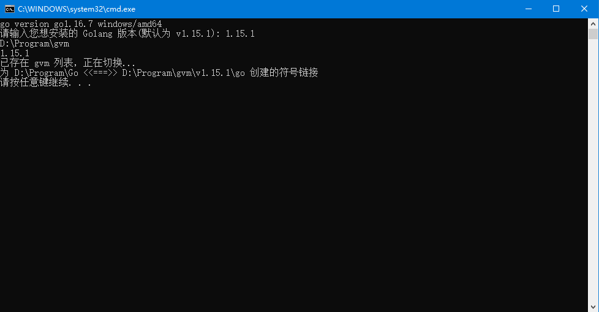
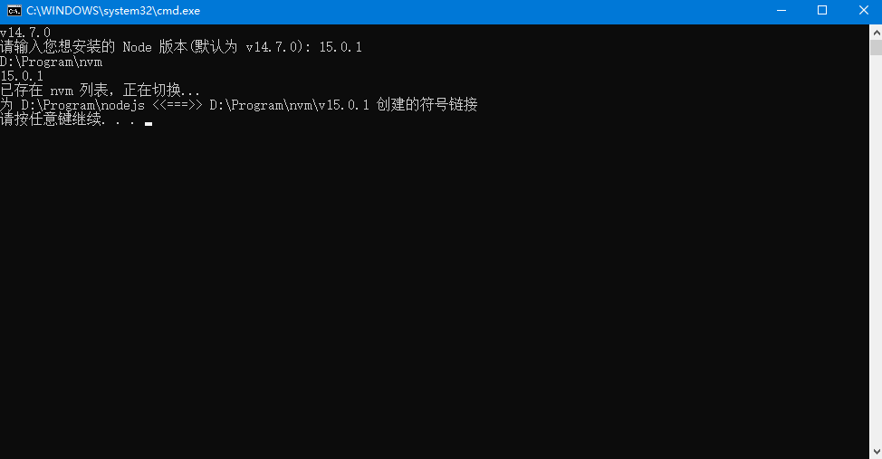
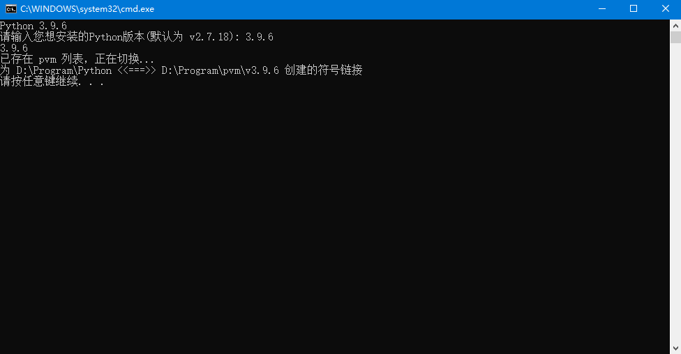

# multi-vm-windows

> 基于 Windows  平台的环境多版本管理工具。通过它可以方便的安装和切换不同版本的环境。如：Python、Golang、Nodejs 等等。大家可根据下面的案例自由发挥其他环境 :smile:

## gvm

>  golang version management

例如：**Path: ** D:\Program\Go

## nvm

> node.js version management

例如：**Path: ** D:\Program\nodejs

## pvm

> python version management

例如：**Path: ** D:\Program\Python

